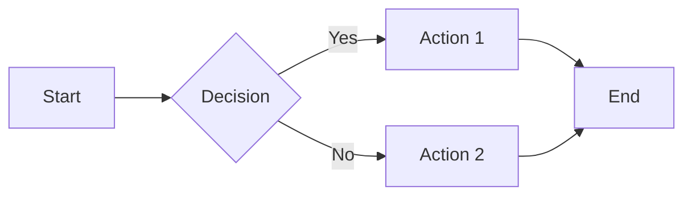
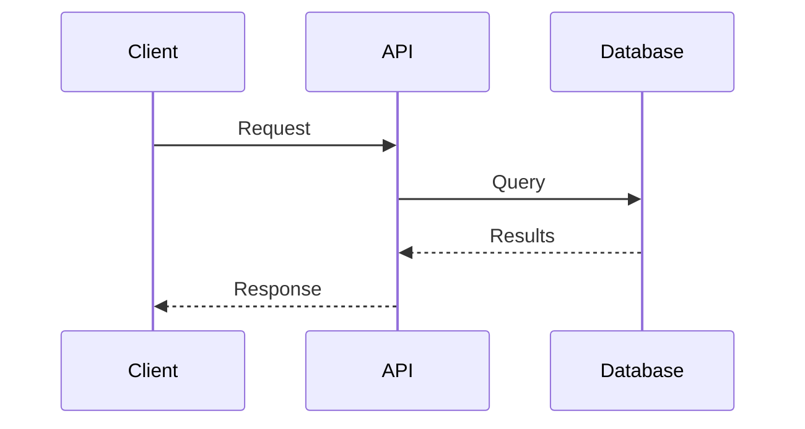
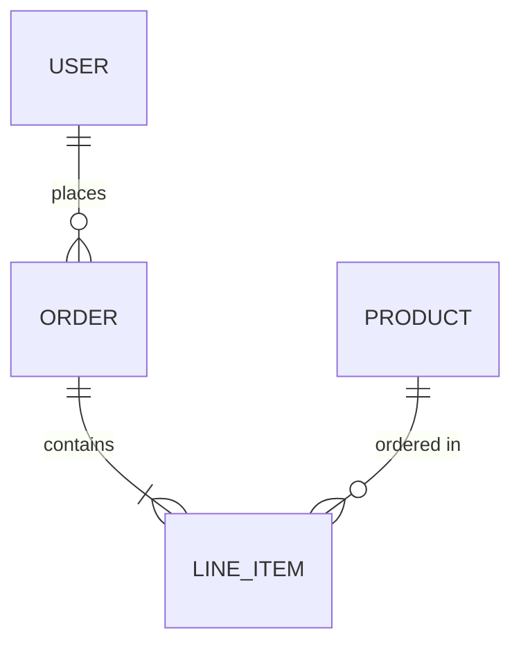
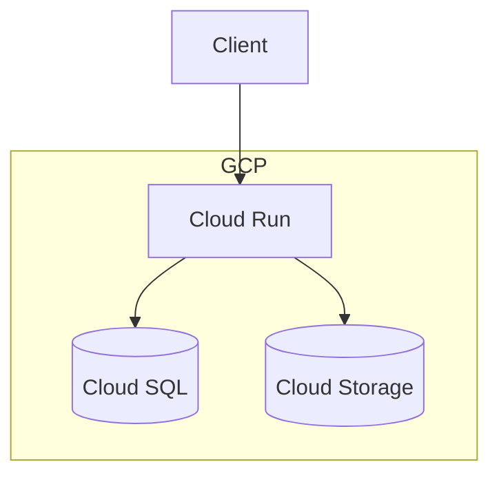

# Documentation Site Standards

> **Version:** 1.0.0
> **Last Updated:** December 2025
> **Extends:** [General Standards](general-standards.md)
> **Template:** [template-mkdocs](https://github.com/landerox/template-mkdocs)

Standards for building documentation sites using MkDocs with Material theme. Includes structure, configuration, and deployment best practices.

---

## Use Cases

| Type | Examples |
|------|----------|
| Project documentation | README expansion, user guides |
| API documentation | Auto-generated from docstrings |
| Knowledge base | Internal standards, runbooks |
| Technical blogs | Engineering blogs, tutorials |
| Package documentation | Library docs with API reference |

---

## Stack

### Core

| Tool | Description |
|------|-------------|
| **MkDocs** | Static site generator for documentation |
| **mkdocs-material** | Material Design theme with rich features |

### Plugins

| Plugin | Description |
|--------|-------------|
| **mkdocstrings** | Auto-generate API docs from docstrings |
| **mkdocs-minify-plugin** | Minify HTML output |
| **mkdocs-git-revision-date-localized-plugin** | Show last updated date |
| **mkdocs-awesome-pages-plugin** | Simplified navigation |
| **mkdocs-redirects** | Redirect old URLs |
| **mkdocs-glightbox** | Image lightbox/zoom |
| **mkdocs-macros-plugin** | Variables and macros |
| **mkdocs-include-markdown-plugin** | Include partial files |
| **mkdocs-table-reader-plugin** | Read tables from CSV/Excel |

### Linting

| Tool | Description |
|------|-------------|
| **markdownlint** | Markdown style linting |
| **cspell** | Spell checking |
| **vale** | Prose linting (optional) |

### Analytics

| Tool | Description |
|------|-------------|
| **Google Analytics 4** | Traffic analytics (privacy concerns) |
| **Plausible** | Privacy-friendly analytics |
| **Cloudflare Analytics** | If using Cloudflare |

---

## Project Structure

```text
docs-project/
├── docs/
│   ├── index.md                 # Home page
│   ├── getting-started/
│   │   ├── index.md
│   │   ├── installation.md
│   │   └── quickstart.md
│   ├── user-guide/
│   │   ├── index.md
│   │   └── ...
│   ├── reference/
│   │   ├── index.md
│   │   └── api.md               # Auto-generated API docs
│   ├── contributing/
│   │   ├── index.md
│   │   └── development.md
│   └── assets/
│       ├── images/
│       └── stylesheets/
│           └── extra.css
├── mkdocs.yml                   # MkDocs configuration
├── pyproject.toml               # Dependencies
├── .markdownlint.yaml           # Markdown linting rules
├── cspell.json                  # Spell check config
└── Justfile                     # Commands
```

---

## MkDocs Configuration

### Minimal mkdocs.yml

```yaml
site_name: My Documentation
site_description: Project documentation
site_author: Your Name
repo_url: https://github.com/user/repo
repo_name: user/repo

theme:
  name: material
  language: en
  palette:
    - scheme: slate
      primary: indigo
      accent: indigo
      toggle:
        icon: material/brightness-4
        name: Switch to light mode
    - scheme: default
      primary: indigo
      accent: indigo
      toggle:
        icon: material/brightness-7
        name: Switch to dark mode
  features:
    - navigation.instant
    - navigation.tracking
    - navigation.sections
    - navigation.expand
    - navigation.indexes
    - navigation.top
    - search.suggest
    - search.highlight
    - content.code.copy
    - content.code.annotate
    - toc.follow

nav:
  - Home: index.md
  - Getting Started:
      - getting-started/index.md
      - Installation: getting-started/installation.md
      - Quickstart: getting-started/quickstart.md
  - User Guide:
      - user-guide/index.md
  - Reference:
      - reference/index.md
      - API: reference/api.md

markdown_extensions:
  - tables
  - admonition
  - pymdownx.details
  - pymdownx.highlight:
      anchor_linenums: true
  - pymdownx.inlinehilite
  - pymdownx.superfences
  - pymdownx.tabbed:
      alternate_style: true
  - pymdownx.tasklist:
      custom_checkbox: true
  - toc:
      permalink: true
      toc_depth: 3
  - attr_list
  - md_in_html

plugins:
  - search:
      lang: en
  - minify:
      minify_html: true

extra:
  social:
    - icon: fontawesome/brands/github
      link: https://github.com/user
  generator: false

extra_css:
  - assets/stylesheets/extra.css
```

### Theme Features

| Feature | Description |
|---------|-------------|
| `navigation.instant` | SPA-like navigation |
| `navigation.tracking` | URL updates on scroll |
| `navigation.sections` | Collapsible sections |
| `navigation.indexes` | Section index pages |
| `navigation.top` | Back to top button |
| `search.suggest` | Search suggestions |
| `search.highlight` | Highlight search terms |
| `content.code.copy` | Copy button on code blocks |
| `content.code.annotate` | Code annotations |
| `toc.follow` | TOC follows scroll |

### Color Schemes

| Scheme | Use Case |
|--------|----------|
| `slate` | Dark mode |
| `default` | Light mode |

**Primary colors:** red, pink, purple, deep purple, indigo, blue, light blue, cyan, teal, green, light green, lime, yellow, amber, orange, deep orange

---

## Markdown Extensions

### Essential Extensions

| Extension | Purpose |
|-----------|---------|
| `tables` | Markdown tables |
| `admonition` | Note/warning/tip boxes |
| `pymdownx.details` | Collapsible blocks |
| `pymdownx.highlight` | Code syntax highlighting |
| `pymdownx.superfences` | Fenced code blocks, diagrams |
| `pymdownx.tabbed` | Tabbed content |
| `toc` | Table of contents |
| `attr_list` | Add HTML attributes |

### Admonitions

```text
!!! note "Optional title"
    Content here.

!!! warning
    Warning content.

!!! tip
    Tip content.

!!! danger
    Danger content.

??? info "Collapsible"
    This is collapsible.
```

**Types:** note, abstract, info, tip, success, question, warning, failure, danger, bug, example, quote

### Tabbed Content

```text
=== "Python"
    ```python
    print("Hello")
    ```

=== "JavaScript"
    ```javascript
    console.log("Hello");
    ```
```

### Code Blocks

```python title="example.py" linenums="1" hl_lines="2 3"
def hello():
    # This line is highlighted
    print("Hello")  # This too
```

---

## Diagrams with Mermaid

### Mermaid Setup

```yaml
# mkdocs.yml
markdown_extensions:
  - pymdownx.superfences:
      custom_fences:
        - name: mermaid
          class: mermaid
          format: !!python/name:pymdownx.superfences.fence_code_format
```

### Flowchart

Use triple backticks with `mermaid` language identifier:



### Sequence Diagram



### Entity Relationship



### Architecture Diagram



### Diagram Best Practices

| Practice | Description |
|----------|-------------|
| Keep simple | Don't overcrowd |
| Use subgraphs | Group related components |
| Consistent direction | LR or TB, not mixed |
| Label relationships | Explain connections |

---

## Images

### Image Optimization

| Format | Use Case |
|--------|----------|
| **WebP** | Photographs, complex images |
| **PNG** | Screenshots, diagrams with text |
| **SVG** | Icons, simple diagrams |

### Optimization Tools

| Tool | Description |
|------|-------------|
| **squoosh** | Web-based compression |
| **imagemin** | CLI compression |
| **svgo** | SVG optimization |

### Image Sizing Guidelines

| Type | Max Width | Format |
|------|-----------|--------|
| Screenshots | 800px | PNG/WebP |
| Diagrams | 600px | SVG/PNG |
| Photos | 1200px | WebP |
| Icons | 64px | SVG |

### Lightbox with glightbox

```yaml
# mkdocs.yml
plugins:
  - glightbox:
      touchNavigation: true
      loop: false
      effect: zoom
      width: 100%
      height: auto
```

Usage:

```text

```

Click to zoom automatically enabled.

### Lazy Loading

```yaml
# mkdocs.yml
plugins:
  - glightbox:
      auto_caption: true

markdown_extensions:
  - attr_list

# In markdown, add loading="lazy"
{ loading=lazy }
```

### Image Captions

```html
<figure markdown>
  { width="600" }
  <figcaption>Caption text here</figcaption>
</figure>
```

---

## Icons

### Material Icons

```yaml
# mkdocs.yml
theme:
  icon:
    repo: fontawesome/brands/github
    admonition:
      note: octicons/tag-16
      tip: octicons/squirrel-16
```

### Inline Icons

```text
:material-account-circle: User profile
:fontawesome-brands-github: GitHub
:octicons-heart-fill-24: Favorite
```

### Icon Search

Browse available icons at: <https://squidfunk.github.io/mkdocs-material/reference/icons-emojis/>

### Custom Icons

```yaml
# mkdocs.yml
theme:
  custom_dir: overrides

# overrides/.icons/custom/my-icon.svg
```

Usage: `:custom-my-icon:`

---

## Analytics Configuration

### Google Analytics 4

```yaml
# mkdocs.yml
extra:
  analytics:
    provider: google
    property: G-XXXXXXXXXX
```

### Plausible (Privacy-Friendly)

```yaml
# mkdocs.yml
extra:
  analytics:
    provider: custom

extra_javascript:
  - https://plausible.io/js/script.js

# With custom domain
extra_javascript:
  - defer: true
    data-domain: docs.example.com
    src: https://plausible.io/js/script.js
```

### Custom HTML for Analytics

```yaml
# mkdocs.yml
theme:
  custom_dir: overrides
```

Create `overrides/main.html`:

```html



  <!-- Custom analytics code -->

```

### Analytics Best Practices

| Practice | Description |
|----------|-------------|
| Privacy policy | Document what you track |
| Cookie consent | If required by law |
| Anonymize IPs | GDPR compliance |
| Consider privacy-first | Plausible, Fathom |

---

## Accessibility (a11y)

### Requirements

| Requirement | Description |
|-------------|-------------|
| Alt text | All images must have descriptions |
| Heading hierarchy | H1 → H2 → H3, no skipping |
| Color contrast | 4.5:1 minimum ratio |
| Keyboard navigation | All interactive elements |
| Link text | Descriptive, not "click here" |

### Alt Text Guidelines

| Do | Don't |
|----|-------|
| "Architecture diagram showing API flow" | "diagram" |
| "Screenshot of login page" | "screenshot" |
| "" (empty) for decorative images | Always add text |

### Heading Structure

```text
# Page Title (only one H1)

## Main Section

### Subsection

### Another Subsection

## Another Main Section
```

### Link Text

| Good | Bad |
|------|-----|
| "Read the installation guide" | "Click here" |
| "View API reference" | "Link" |
| "Download PDF" | "Here" |

### Color Contrast

| Element | Minimum Ratio |
|---------|---------------|
| Normal text | 4.5:1 |
| Large text (18px+) | 3:1 |
| UI components | 3:1 |

### Testing Tools

| Tool | Description |
|------|-------------|
| **axe** | Browser extension |
| **WAVE** | Web accessibility evaluation |
| **Lighthouse** | Chrome DevTools audit |
| **pa11y** | CLI accessibility testing |

### Accessibility in mkdocs.yml

```yaml
# mkdocs.yml
theme:
  palette:
    # Use high contrast colors
    primary: indigo  # Good contrast

markdown_extensions:
  - attr_list  # For adding aria-labels
```

---

## Search Configuration

### Basic Search

```yaml
# mkdocs.yml
plugins:
  - search:
      lang: en
```

### Advanced Search

```yaml
# mkdocs.yml
plugins:
  - search:
      lang: en
      separator: '[\s\-\.]+'
      pipeline:
        - stemmer
        - stopWordFilter
        - trimmer
```

### Search Features

| Feature | Configuration |
|---------|---------------|
| Suggestions | `theme.features: [search.suggest]` |
| Highlighting | `theme.features: [search.highlight]` |
| Keyboard shortcuts | `theme.features: [search.share]` |

### Boost Important Pages

```yaml
---
search:
  boost: 2
---

# Important Page

This page will rank higher in search.
```

### Exclude from Search

```yaml
---
search:
  exclude: true
---

# Draft Page

This page won't appear in search.
```

---

## Custom 404 Page

### 404 Page Setup

Create `docs/404.md`:

```yaml
---
template: 404.html
---

# Page Not Found

The page you're looking for doesn't exist.

[Go to Home](/)
```

Or use theme override:

```yaml
# mkdocs.yml
theme:
  custom_dir: overrides
```

Create `overrides/404.html`:

```html



<h1>404 - Page Not Found</h1>
<p>Sorry, the page you're looking for doesn't exist.</p>
<a href="{{ config.site_url }}">Go to Home</a>

```

---

## Macros and Variables

### Macros Setup

```yaml
# mkdocs.yml
plugins:
  - macros:
      module_name: docs/macros
```

### Define Variables

```yaml
# mkdocs.yml
extra:
  version: 1.0.0
  company: My Company
  repo_url: https://github.com/user/repo
```

### Use in Markdown

```text
Current version: {{ version }}

Company: {{ company }}

[View source]({{ repo_url }})
```

### Custom Macros

Create `docs/macros.py`:

```python
def define_env(env):
    @env.macro
    def button(text, url):
        return f'<a href="{url}" class="md-button">{text}</a>'
```

Usage:

```text
{{ button("Get Started", "/getting-started/") }}
```

---

## Include Partial Files

### Include Plugin Setup

```yaml
# mkdocs.yml
plugins:
  - include-markdown
```

### Usage

```text
# Main Document



## Specific Content


```

### Include Use Cases

| Use Case | Description |
|----------|-------------|
| Shared content | Reuse across pages |
| Generated content | Include from build |
| Code snippets | From actual source files |
| Changelogs | Include CHANGELOG.md |

---

## API Documentation

### mkdocstrings Configuration

```yaml
# mkdocs.yml
plugins:
  - mkdocstrings:
      handlers:
        python:
          options:
            docstring_style: google
            show_source: true
            show_root_heading: true
            members_order: source
```

### Usage in Markdown

```text
# API Reference

::: mypackage.module
    options:
      show_root_heading: true
      members_order: source

## Specific Class

::: mypackage.module.MyClass
    options:
      members:
        - method1
        - method2
```

### Docstring Style (Google)

```python
def process(data: str, count: int = 10) -> list[str]:
    """Process data and return results.

    This function takes input data and processes it
    according to the specified parameters.

    Args:
        data: Input data to process.
        count: Number of results to return. Defaults to 10.

    Returns:
        List of processed strings.

    Raises:
        ValueError: If data is empty.
        ProcessingError: If processing fails.

    Examples:
        >>> process("hello", count=5)
        ['hello', 'hello', 'hello', 'hello', 'hello']
    """
```

---

## Navigation

### Structure Best Practices

| Practice | Description |
|----------|-------------|
| Max 2 levels | Don't nest too deep |
| Index pages | Each section has index.md |
| Logical grouping | By user task, not internal structure |
| Consistent naming | Lowercase, hyphens |

### Navigation Types

| Type | When to Use |
|------|-------------|
| **Explicit nav** | Full control, defined in mkdocs.yml |
| **Auto nav** | Simple sites, directory-based |
| **awesome-pages** | Mixed approach, .pages files |

### Section Index Pages

```yaml
nav:
  - Getting Started:
      - getting-started/index.md    # Section landing page
      - Installation: getting-started/installation.md
```

With `navigation.indexes` feature, index.md becomes the section page.

---

## Writing Guidelines

### Document Structure

| Section | Content |
|---------|---------|
| Title (H1) | One per page, matches nav |
| Introduction | What and why, 1-2 paragraphs |
| Prerequisites | What reader needs |
| Main content | Steps, explanations |
| Next steps | Links to related docs |

### Style Guide

| Do | Don't |
|----|-------|
| Use active voice | Use passive voice |
| Be concise | Be verbose |
| Use examples | Only describe abstractly |
| Address reader as "you" | Use "the user" |
| Use present tense | Use future tense |

### Headings

| Level | Use |
|-------|-----|
| H1 (`#`) | Page title only, one per page |
| H2 (`##`) | Major sections |
| H3 (`###`) | Subsections |
| H4+ | Avoid if possible |

### Code Examples

| Practice | Description |
|----------|-------------|
| Working examples | Code should be runnable |
| Explain context | When to use this code |
| Show output | Expected results |
| Keep short | Break into steps if long |

---

## Markdown Linting

### markdownlint Configuration

```yaml
# .markdownlint.yaml
default: true

# Allow longer lines
MD013:
  line_length: 120
  tables: false
  code_blocks: false

# Allow multiple H1 (for index pages)
MD025: false

# Allow inline HTML
MD033: false

# Allow bare URLs
MD034: false
```

### Spell Checking with cspell

```json
{
  "version": "0.2",
  "language": "en",
  "words": [
    "mkdocs",
    "pymdownx",
    "docstrings",
    "pydantic"
  ],
  "ignorePaths": [
    "node_modules",
    ".git",
    "site"
  ]
}
```

### Vale (Optional Prose Linting)

| Check | Description |
|-------|-------------|
| Spelling | Dictionary-based |
| Grammar | Common mistakes |
| Style | Writing guidelines |
| Terminology | Consistent terms |

---

## Development

### Local Development

```bash
# Install dependencies
uv sync

# Serve with hot reload
just serve
# or
mkdocs serve

# Build static site
just build
# or
mkdocs build
```

### Justfile Commands

```makefile
# Justfile
serve:
    mkdocs serve --dev-addr localhost:8000

build:
    mkdocs build --strict

lint:
    markdownlint docs/**/*.md
    cspell docs/**/*.md

deploy:
    mkdocs gh-deploy --force
```

### Pre-commit Hooks

```yaml
# .pre-commit-config.yaml
repos:
  - repo: https://github.com/igorshubovych/markdownlint-cli
    rev: v0.39.0
    hooks:
      - id: markdownlint
        args: ["--fix"]

  - repo: https://github.com/streetsidesoftware/cspell-cli
    rev: v8.6.0
    hooks:
      - id: cspell
```

---

## Deployment

### GitHub Pages

```yaml
# .github/workflows/docs.yml
name: Deploy Docs

on:
  push:
    branches: [main]
    paths:
      - 'docs/**'
      - 'mkdocs.yml'

jobs:
  deploy:
    runs-on: ubuntu-latest
    steps:
      - uses: actions/checkout@v4

      - name: Setup Python
        uses: actions/setup-python@v5
        with:
          python-version: '3.12'

      - name: Install uv
        uses: astral-sh/setup-uv@v4

      - name: Install dependencies
        run: uv sync

      - name: Deploy
        run: uv run mkdocs gh-deploy --force
```

### Cloud Storage (GCS)

```yaml
# Deploy to GCS bucket
- name: Build
  run: uv run mkdocs build

- name: Upload to GCS
  uses: google-github-actions/upload-cloud-storage@v2
  with:
    path: site
    destination: my-docs-bucket
```

### Versioned Documentation

| Tool | Description |
|------|-------------|
| **mike** | Version management for MkDocs |

```bash
# Deploy version
mike deploy --push --update-aliases 1.0 latest

# List versions
mike list
```

---

## SEO and Metadata

### Page Metadata

```yaml
---
title: Page Title
description: Page description for SEO
---

# Page Title

Content here...
```

### Social Cards

```yaml
# mkdocs.yml
plugins:
  - social:
      cards: true
```

Generates Open Graph images automatically.

### Sitemap

```yaml
# mkdocs.yml
plugins:
  - search
  - sitemap
```

---

## Best Practices

### Content Organization

| Practice | Description |
|----------|-------------|
| Task-based structure | Organize by what users want to do |
| Progressive disclosure | Simple first, advanced later |
| Cross-linking | Link related pages |
| Changelog | Document changes |

### Maintenance

| Practice | Description |
|----------|-------------|
| Review regularly | Quarterly content review |
| Update screenshots | Keep visuals current |
| Check links | Automated link checking |
| Version sync | Docs match code version |

### Performance

| Practice | Description |
|----------|-------------|
| Optimize images | Compress, use WebP |
| Minify HTML | Use minify plugin |
| Lazy load | For heavy pages |

---

## Additional Files

Documentation sites include:

| File | Purpose |
|------|---------|
| `mkdocs.yml` | MkDocs configuration |
| `docs/` | Markdown source files |
| `docs/assets/` | Images, CSS |
| `.markdownlint.yaml` | Markdown linting |
| `cspell.json` | Spell checking |

---

## Dependencies

### pyproject.toml

```toml
[project]
name = "my-docs"
version = "0.1.0"
requires-python = ">=3.12"

dependencies = [
    # Core
    "mkdocs>=1.6",
    "mkdocs-material>=9.5",

    # Plugins
    "mkdocs-minify-plugin>=0.8",
    "mkdocstrings[python]>=0.24",
    "mkdocs-git-revision-date-localized-plugin>=1.2",
    "mkdocs-glightbox>=0.4",
    "mkdocs-macros-plugin>=1.0",
    "mkdocs-include-markdown-plugin>=6.0",
    "mkdocs-redirects>=1.2",
    "mkdocs-awesome-pages-plugin>=2.9",
]

[project.optional-dependencies]
dev = [
    "markdownlint-cli2",
]
```

---

## Related Standards

| Standard | Description |
|----------|-------------|
| [General Standards](general-standards.md) | Base standards |
| [Python Package](python-package.md) | For API documentation |
